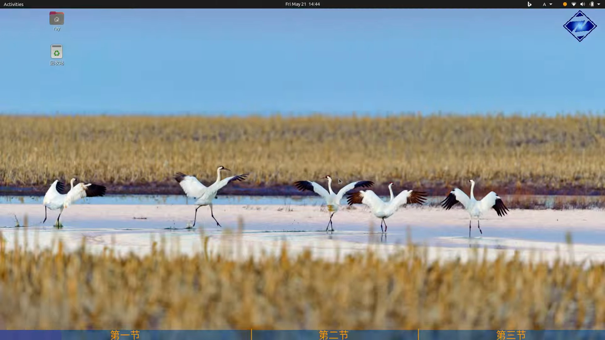

A simple tool to add toc with progress bar to video.

# Prerequisite

`ffmpeg` and `ffprobe`.

# Usage

A `config.toml` and a `toc.txt` must be presented in working directory.

```shell
./vtoc input out
```

or just a few seconds to preview the effect

```
./vtoc input output 2
```

# Snapshot

